# Arquitectura del Proyecto - Clean Architecture

## 📐 Estructura del Proyecto

```
auth-service-project/
├── src/
│   ├── domain/                 # Capa de Dominio
│   │   ├── entities/          # Entidades de negocio
│   │   │   └── User.ts
│   │   └── repositories/      # Interfaces de repositorios
│   │       └── UserRepository.ts
│   │
│   ├── application/            # Capa de Aplicación
│   │   └── use-cases/         # Casos de uso
│   │       ├── CreateUserUseCase.ts
│   │       ├── LoginUserUseCase.ts
│   │       └── GetUserUseCase.ts
│   │
│   ├── infrastructure/         # Capa de Infraestructura
│   │   ├── database/          # Configuración de BD
│   │   │   └── DatabaseConnection.ts
│   │   ├── repositories/      # Implementación de repositorios
│   │   │   └── MySQLUserRepository.ts
│   │   ├── App.ts             # Configuración de Express
│   │   └── server.ts          # Punto de entrada
│   │
│   └── interfaces/             # Capa de Interfaces
│       ├── controllers/       # Controladores HTTP
│       │   └── UserController.ts
│       └── routes/            # Definición de rutas
│           ├── userRoutes.ts
│           └── index.ts
│
├── .vscode/
│   ├── launch.json            # Configuración de debug
│   ├── settings.json
│   └── extensions.json
├── database/
│   └── init.sql               # Script de inicialización
├── .env                        # Variables de entorno
├── .env.example
├── .gitignore
├── package.json
├── tsconfig.json
├── README.md
├── API_EXAMPLES.md
├── DATABASE_SETUP.md
└── ARCHITECTURE.md
```

---

## 🏗️ Diagrama de Capas - Clean Architecture

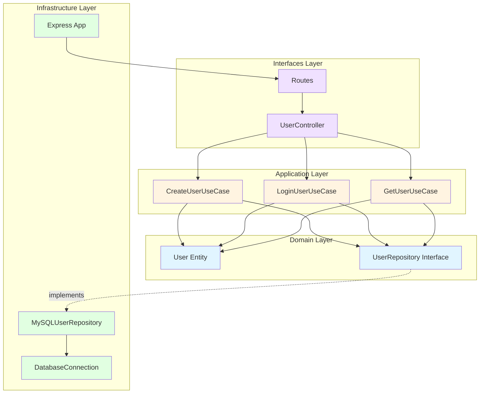

---

## 🔄 Diagrama de Flujo - Registro de Usuario

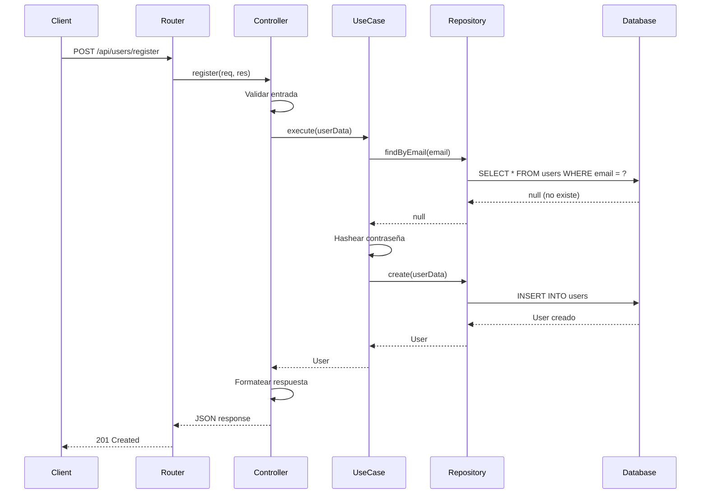

---

## 🎯 Diagrama de Componentes

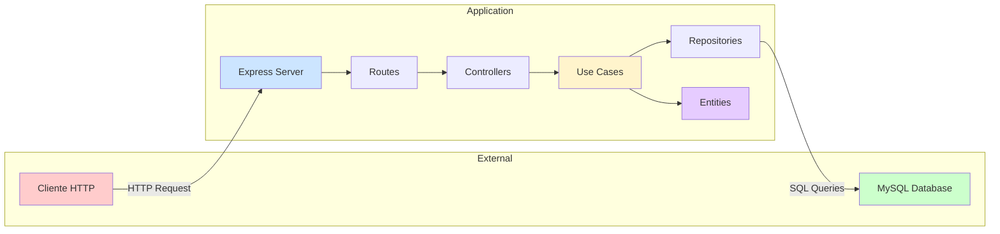

---

## 📊 Diagrama de Dependencias

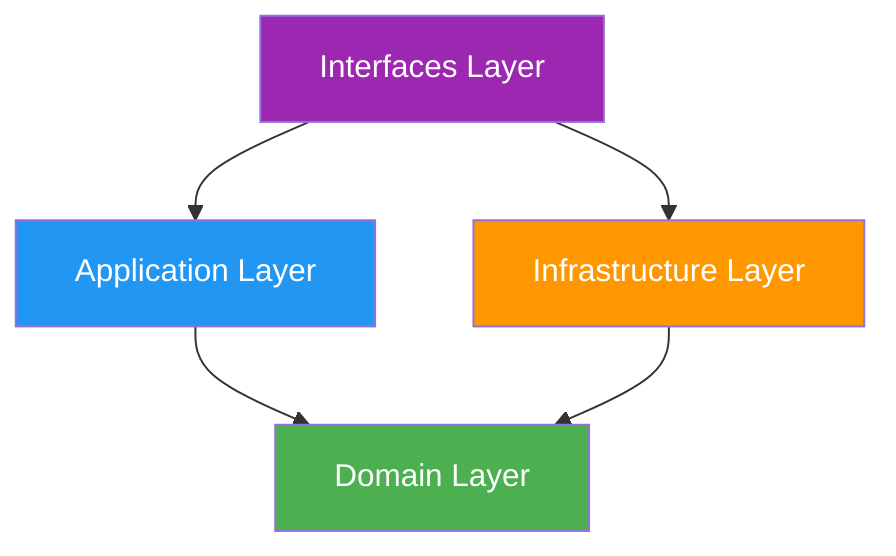

**Regla de Dependencia:** Las flechas apuntan hacia adentro (hacia el dominio)

---

## 🔀 Diagrama de Casos de Uso

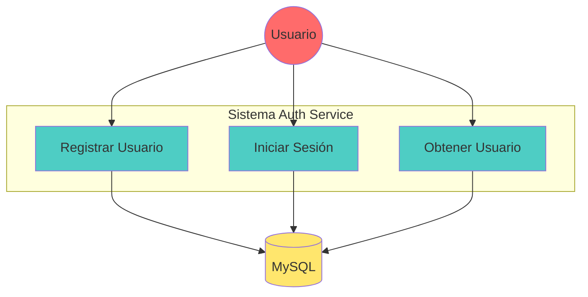

---

## 🏛️ Principios de Clean Architecture

### 1. **Capa de Dominio (Domain Layer)**

**Responsabilidad:** Lógica de negocio pura, independiente de frameworks y tecnologías.

**Contenido:**

- **Entidades** (`entities/`): Modelos de datos del negocio
  - `User.ts`: Define la entidad User y sus DTOs
- **Interfaces de Repositorios** (`repositories/`): Contratos para acceso a datos
  - `UserRepository.ts`: Define operaciones CRUD sin implementación

**Características:**

- ✅ No tiene dependencias externas
- ✅ No conoce detalles de implementación
- ✅ Código reutilizable y testeable
- ✅ Reglas de negocio centralizadas

---

### 2. **Capa de Aplicación (Application Layer)**

**Responsabilidad:** Casos de uso y orquestación de la lógica de negocio.

**Contenido:**

- **Casos de Uso** (`use-cases/`): Flujos específicos de la aplicación
  - `CreateUserUseCase.ts`: Crear usuario con validaciones
  - `LoginUserUseCase.ts`: Autenticación y generación de JWT
  - `GetUserUseCase.ts`: Obtener información de usuario

**Características:**

- ✅ Orquesta entidades del dominio
- ✅ Implementa reglas de negocio específicas
- ✅ Depende solo de la capa de dominio
- ✅ Independiente de frameworks

**Ejemplo de flujo:**

```typescript
// CreateUserUseCase coordina:
1. Validar email único (UserRepository)
2. Hashear contraseña (bcrypt)
3. Crear usuario (UserRepository)
4. Retornar usuario creado
```

---

### 3. **Capa de Infraestructura (Infrastructure Layer)**

**Responsabilidad:** Implementaciones concretas de tecnologías y frameworks.

**Contenido:**

- **Database** (`database/`): Conexión y configuración de MySQL
  - `DatabaseConnection.ts`: Singleton para pool de conexiones
- **Repositories** (`repositories/`): Implementación de interfaces del dominio
  - `MySQLUserRepository.ts`: Implementa UserRepository con MySQL
- **App** (`App.ts`): Configuración de Express, middlewares, rutas
- **Server** (`server.ts`): Punto de entrada de la aplicación

**Características:**

- ✅ Implementa interfaces del dominio
- ✅ Maneja detalles técnicos (DB, HTTP, etc.)
- ✅ Puede ser reemplazada sin afectar el negocio
- ✅ Contiene configuración específica

**Ejemplo:**

```typescript
// MySQLUserRepository implementa UserRepository
class MySQLUserRepository implements UserRepository {
  async create(userData: CreateUserDTO): Promise<User> {
    // Implementación específica con MySQL
  }
}
```

---

### 4. **Capa de Interfaces (Interfaces Layer)**

**Responsabilidad:** Entrada/salida del sistema (HTTP, CLI, WebSockets, etc.).

**Contenido:**

- **Controllers** (`controllers/`): Manejan requests HTTP
  - `UserController.ts`: Endpoints de usuarios
- **Routes** (`routes/`): Definición de rutas Express
  - `userRoutes.ts`: Rutas de `/api/users/*`
  - `index.ts`: Agrupación de todas las rutas

**Características:**

- ✅ Adapta requests externos a casos de uso
- ✅ Maneja validación de entrada
- ✅ Formatea respuestas
- ✅ Gestiona códigos HTTP

**Flujo de una petición:**

```
HTTP Request → Route → Controller → Use Case → Repository → Database
                  ↓
              Response
```

---

## 🔄 Flujo de Datos

### Ejemplo: Registro de Usuario

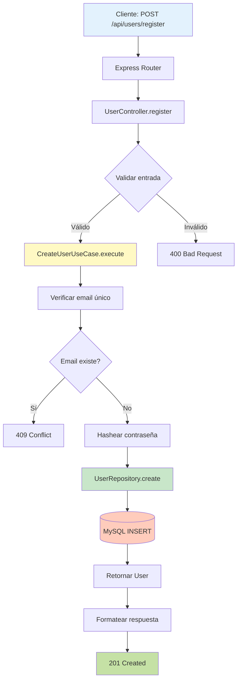

---

## 🎯 Ventajas de esta Arquitectura

### 1. **Separación de Responsabilidades**

Cada capa tiene una responsabilidad clara y única.

### 2. **Testabilidad**

- Casos de uso pueden testearse sin base de datos
- Repositories pueden mockearse fácilmente
- Lógica de negocio aislada

### 3. **Mantenibilidad**

- Cambios en una capa no afectan otras
- Fácil de entender y navegar
- Código organizado por conceptos

### 4. **Escalabilidad**

- Fácil agregar nuevos casos de uso
- Fácil cambiar de tecnologías
- Fácil agregar nuevas interfaces (GraphQL, CLI, etc.)

### 5. **Independencia de Frameworks**

- La lógica de negocio no depende de Express
- Fácil migrar a otro framework
- Testeable sin servidor HTTP

---

## 🔀 Dependency Injection

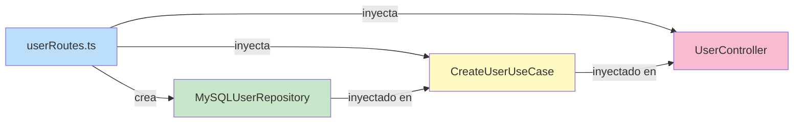

El proyecto usa inyección de dependencias manual:

```typescript
// En userRoutes.ts
const userRepository = new MySQLUserRepository();
const createUserUseCase = new CreateUserUseCase(userRepository);
const userController = new UserController(createUserUseCase, ...);
```

**Ventajas:**

- Los casos de uso reciben dependencias como parámetros
- Fácil sustituir implementaciones
- Facilita testing con mocks

---

## 🧪 Testing Strategy

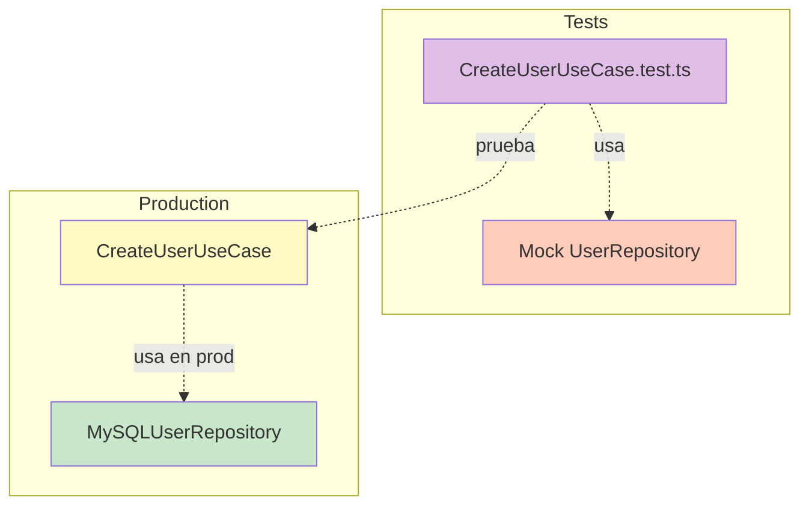

```typescript
// Test de CreateUserUseCase
const mockRepository: UserRepository = {
  create: jest.fn(),
  findByEmail: jest.fn(),
  // ...
};

const useCase = new CreateUserUseCase(mockRepository);
// Testear sin base de datos real
```

---

## 🚀 Extender la Arquitectura

### Agregar un nuevo caso de uso:

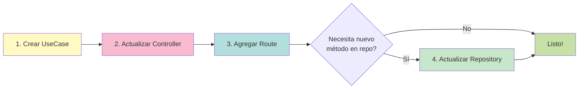

### Cambiar de MySQL a PostgreSQL:

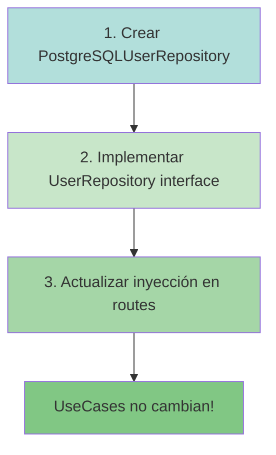

1. Crear `PostgreSQLUserRepository.ts` en `infrastructure/repositories/`
2. Implementar la interfaz `UserRepository`
3. Actualizar la inyección en `userRoutes.ts`
4. ¡Listo! Los casos de uso no cambian

---

## 📊 Diagrama de Clases

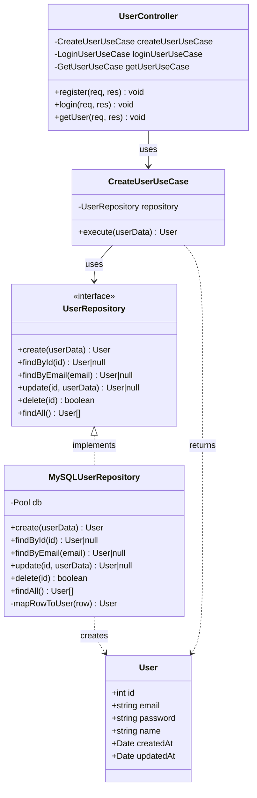

---

## 📚 Recursos Adicionales

- **Clean Architecture** by Robert C. Martin
- **Domain-Driven Design** by Eric Evans
- **SOLID Principles**
- **Dependency Inversion Principle**

---

## 🎓 Conceptos Clave

| Concepto                  | Descripción                       |
| ------------------------- | --------------------------------- |
| **Entity**                | Objeto con identidad única (User) |
| **Use Case**              | Acción específica del sistema     |
| **Repository**            | Abstracción para acceso a datos   |
| **DTO**                   | Data Transfer Object              |
| **Dependency Injection**  | Proveer dependencias externamente |
| **Interface Segregation** | Interfaces específicas y pequeñas |
