# Arquitectura del Proyecto - Clean Architecture + Optimizaciones

## 📐 Estructura del Proyecto

```
auth-service-project/
├── src/
│   ├── domain/                 # Capa de Dominio
│   │   ├── entities/          # Entidades de negocio
│   │   │   └── User.ts
│   │   └── repositories/      # Interfaces de repositorios
│   │       ├── UserRepository.ts
│   │       └── SessionRepository.ts
│   │
│   ├── application/            # Capa de Aplicación
│   │   └── use-cases/         # Casos de uso
│   │       ├── CreateUserUseCase.ts
│   │       ├── LoginUserUseCase.ts
│   │       ├── GetUserUseCase.ts
│   │       └── LogoutUserUseCase.ts
│   │
│   ├── infrastructure/         # Capa de Infraestructura
│   │   ├── database/          # Configuración de BD
│   │   │   ├── DatabaseConnection.ts
│   │   │   ├── DynamoDBConnection.ts
│   │   │   └── RedisConnection.ts
│   │   ├── cache/             # Capa de caché
│   │   │   └── RedisCache.ts
│   │   ├── repositories/      # Implementación de repositorios
│   │   │   ├── MySQLUserRepository.ts
│   │   │   ├── CachedUserRepository.ts (Decorator)
│   │   │   └── DynamoDBSessionRepository.ts
│   │   ├── middleware/        # Middlewares
│   │   │   ├── AuthMiddleware.ts
│   │   │   ├── ValidationMiddleware.ts
│   │   │   ├── RateLimitMiddleware.ts
│   │   │   └── PerformanceMonitor.ts
│   │   ├── App.ts             # Configuración de Express
│   │   └── server.ts          # Punto de entrada
│   │
│   └── interfaces/             # Capa de Interfaces
│       ├── controllers/       # Controladores HTTP
│       │   └── UserController.ts
│       └── routes/            # Definición de rutas
│           ├── userRoutes.ts
│           └── index.ts
│
├── .vscode/
│   ├── launch.json            # Configuración de debug
│   ├── settings.json
│   └── extensions.json
├── database/
│   └── init.sql               # Script de inicialización MySQL
├── docker-compose.yml          # Orquestación de servicios
├── Dockerfile                  # Contenedor de la API
├── .dockerignore
├── .env                        # Variables de entorno
├── .env.example
├── .gitignore
├── package.json
├── tsconfig.json
├── README.md
├── API_EXAMPLES.md
├── DATABASE_SETUP.md
├── ARCHITECTURE.md
├── OPTIMIZATION_GUIDE.md       # Guía de optimizaciones
├── RATE_LIMIT_TESTING.md       # Testing de rate limiting
├── DYNAMODB_SESSIONS_GUIDE.md  # Sesiones en DynamoDB
└── LOCALSTACK_GUIDE.md         # LocalStack local
```

---

## 🏗️ Diagrama de Capas - Clean Architecture + Optimizaciones

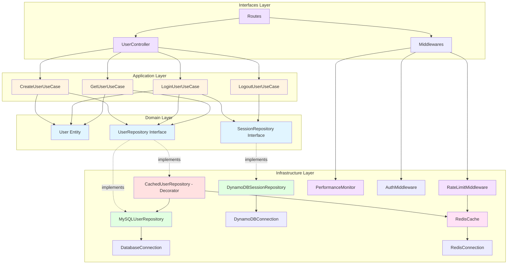

---

## 🔄 Diagrama de Flujo - Registro de Usuario (Con Optimizaciones)

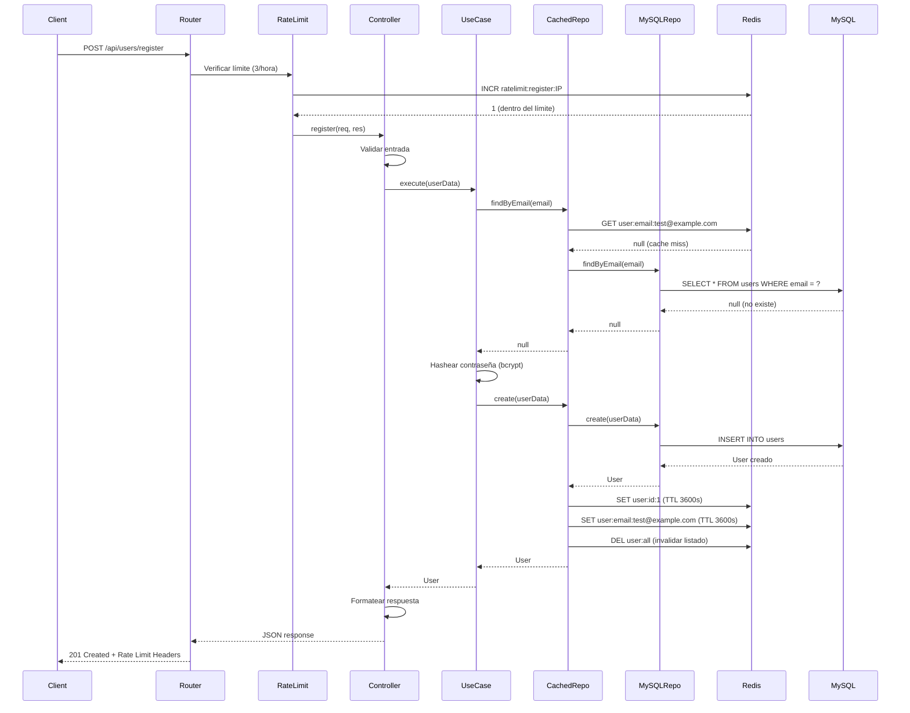

---

## 🎯 Diagrama de Componentes (Arquitectura Completa)

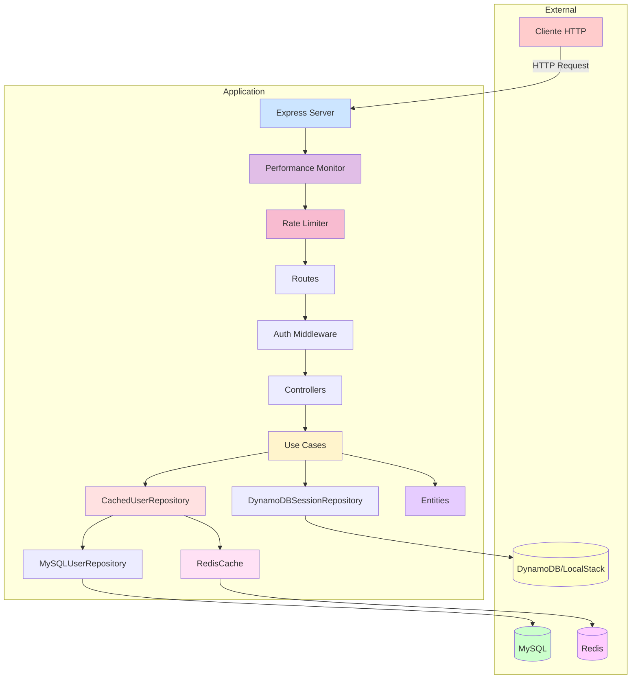

---

## 📊 Diagrama de Dependencias

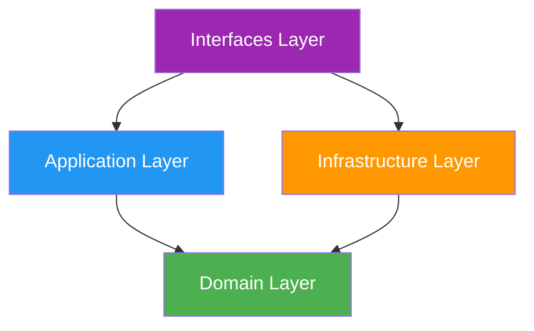

**Regla de Dependencia:** Las flechas apuntan hacia adentro (hacia el dominio)

---

## 🔀 Diagrama de Casos de Uso

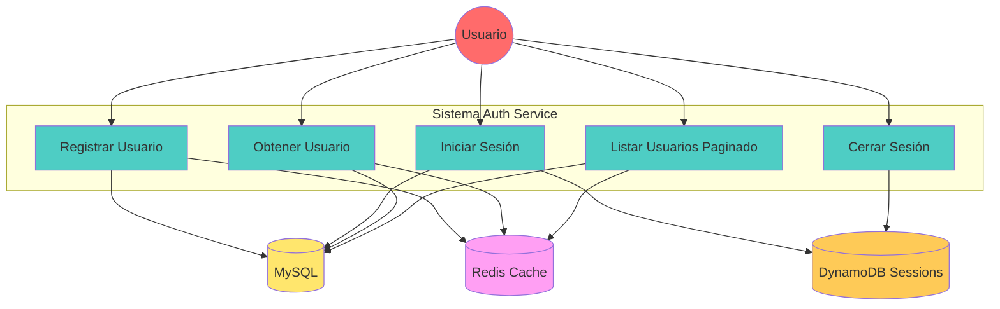

---

## 🗄️ Arquitectura de Datos - Tres Capas

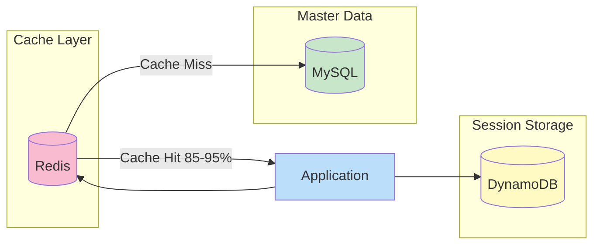

**Responsabilidades:**

- **MySQL**: Base de datos principal (usuarios, datos maestros)
- **Redis**: Caché en memoria (1h TTL, hit rate 85-95%)
- **DynamoDB**: Sesiones de usuario (24h TTL automático)

---

## 🏛️ Principios de Clean Architecture

### 1. **Capa de Dominio (Domain Layer)**

**Responsabilidad:** Lógica de negocio pura, independiente de frameworks y tecnologías.

**Contenido:**

- **Entidades** (`entities/`): Modelos de datos del negocio
  - `User.ts`: Define la entidad User y sus DTOs
- **Interfaces de Repositorios** (`repositories/`): Contratos para acceso a datos
  - `UserRepository.ts`: Define operaciones CRUD sin implementación

**Características:**

- ✅ No tiene dependencias externas
- ✅ No conoce detalles de implementación
- ✅ Código reutilizable y testeable
- ✅ Reglas de negocio centralizadas

---

### 2. **Capa de Aplicación (Application Layer)**

**Responsabilidad:** Casos de uso y orquestación de la lógica de negocio.

**Contenido:**

- **Casos de Uso** (`use-cases/`): Flujos específicos de la aplicación
  - `CreateUserUseCase.ts`: Crear usuario con validaciones
  - `LoginUserUseCase.ts`: Autenticación y generación de JWT
  - `GetUserUseCase.ts`: Obtener información de usuario

**Características:**

- ✅ Orquesta entidades del dominio
- ✅ Implementa reglas de negocio específicas
- ✅ Depende solo de la capa de dominio
- ✅ Independiente de frameworks

**Ejemplo de flujo:**

```typescript
// CreateUserUseCase coordina:
1. Validar email único (UserRepository)
2. Hashear contraseña (bcrypt)
3. Crear usuario (UserRepository)
4. Retornar usuario creado
```

---

### 3. **Capa de Infraestructura (Infrastructure Layer)**

**Responsabilidad:** Implementaciones concretas de tecnologías y frameworks.

**Contenido:**

- **Database** (`database/`): Conexiones a bases de datos
  - `DatabaseConnection.ts`: Singleton para pool de conexiones MySQL
  - `DynamoDBConnection.ts`: Cliente de DynamoDB/LocalStack
  - `RedisConnection.ts`: Cliente de Redis para caché
- **Cache** (`cache/`): Sistema de caché
  - `RedisCache.ts`: Utilidad genérica para operaciones de caché
- **Repositories** (`repositories/`): Implementación de interfaces del dominio
  - `MySQLUserRepository.ts`: Implementa UserRepository con MySQL
  - `CachedUserRepository.ts`: Decorator que agrega caché a UserRepository
  - `DynamoDBSessionRepository.ts`: Implementa SessionRepository con DynamoDB
- **Middleware** (`middleware/`): Middlewares de Express
  - `AuthMiddleware.ts`: Autenticación JWT + validación de sesión
  - `ValidationMiddleware.ts`: Validación de DTOs
  - `RateLimitMiddleware.ts`: Limitación de requests con Redis
  - `PerformanceMonitor.ts`: Monitoreo de rendimiento
- **App** (`App.ts`): Configuración de Express, middlewares, rutas
- **Server** (`server.ts`): Punto de entrada de la aplicación

**Características:**

- ✅ Implementa interfaces del dominio
- ✅ Maneja detalles técnicos (DB, HTTP, Cache, etc.)
- ✅ Puede ser reemplazada sin afectar el negocio
- ✅ Contiene configuración específica
- ✅ **Patrón Decorator** en CachedUserRepository

**Ejemplo:**

```typescript
// CachedUserRepository implementa UserRepository usando Decorator Pattern
class CachedUserRepository implements UserRepository {
  constructor(
    private baseRepository: UserRepository, // MySQLUserRepository
    private cacheTTL: number = 3600
  ) {}

  async findById(id: number): Promise<User | null> {
    // 1. Buscar en caché
    const cached = await this.cache.get(`user:id:${id}`);
    if (cached) return cached;

    // 2. Cache miss: buscar en MySQL
    const user = await this.baseRepository.findById(id);

    // 3. Guardar en caché
    if (user) {
      await this.cache.set(`user:id:${id}`, user, this.cacheTTL);
    }

    return user;
  }
}
```

---

### 4. **Capa de Interfaces (Interfaces Layer)**

**Responsabilidad:** Entrada/salida del sistema (HTTP, CLI, WebSockets, etc.).

**Contenido:**

- **Controllers** (`controllers/`): Manejan requests HTTP
  - `UserController.ts`: Endpoints de usuarios
- **Routes** (`routes/`): Definición de rutas Express
  - `userRoutes.ts`: Rutas de `/api/users/*`
  - `index.ts`: Agrupación de todas las rutas

**Características:**

- ✅ Adapta requests externos a casos de uso
- ✅ Maneja validación de entrada
- ✅ Formatea respuestas
- ✅ Gestiona códigos HTTP

**Flujo de una petición:**

```
HTTP Request → Route → Controller → Use Case → Repository → Database
                  ↓
              Response
```

---

## 🔄 Flujo de Datos

### Ejemplo 1: Registro de Usuario (Con Cache)

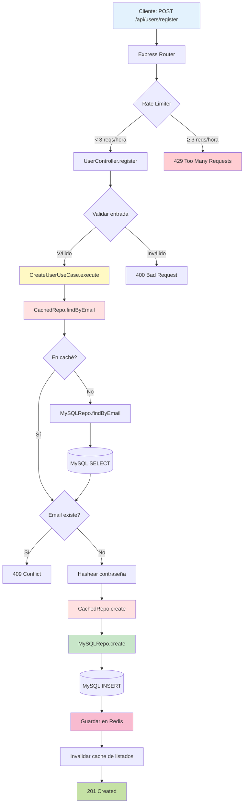

### Ejemplo 2: Login con Sesiones en DynamoDB

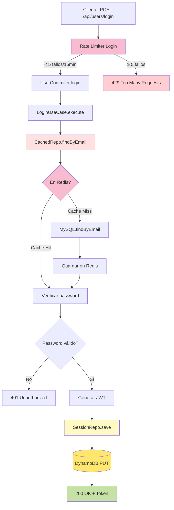

### Ejemplo 3: Request Protegida con Cache

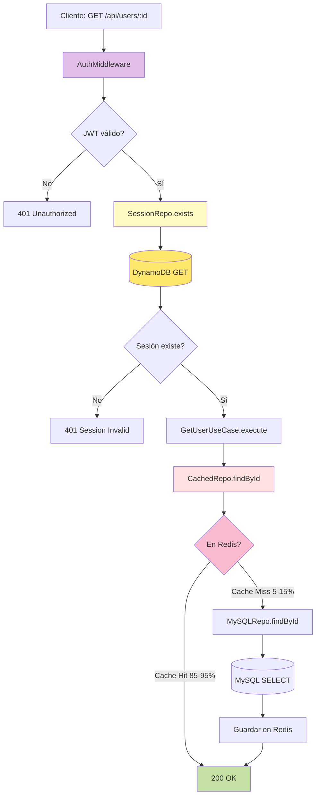

---

## 🎯 Ventajas de esta Arquitectura

### 1. **Separación de Responsabilidades**

Cada capa tiene una responsabilidad clara y única.

### 2. **Testabilidad**

- Casos de uso pueden testearse sin base de datos
- Repositories pueden mockearse fácilmente
- Lógica de negocio aislada
- **Caché puede desactivarse para testing**

### 3. **Mantenibilidad**

- Cambios en una capa no afectan otras
- Fácil de entender y navegar
- Código organizado por conceptos
- **Patrón Decorator permite agregar funcionalidad sin modificar código existente**

### 4. **Escalabilidad**

- Fácil agregar nuevos casos de uso
- Fácil cambiar de tecnologías
- Fácil agregar nuevas interfaces (GraphQL, CLI, etc.)
- **Redis reduce carga en MySQL (85-95% cache hit)**
- **Rate limiting previene sobrecarga**
- **Connection pooling optimizado**

### 5. **Independencia de Frameworks**

- La lógica de negocio no depende de Express
- Fácil migrar a otro framework
- Testeable sin servidor HTTP

### 6. **Performance**

- **Redis Cache**: Latencia <1ms vs MySQL 10-50ms
- **Connection Pool**: Reutilización eficiente de conexiones
- **Paginación**: Evita cargar datos innecesarios
- **Performance Monitor**: Detección de endpoints lentos

### 7. **Seguridad**

- **Rate Limiting**: Protección contra abuso y DDoS
- **JWT + Sesiones**: Doble validación en requests protegidas
- **Bcrypt**: Hash seguro de contraseñas
- **Validación**: DTOs validados antes de procesar

---

## 🔀 Dependency Injection

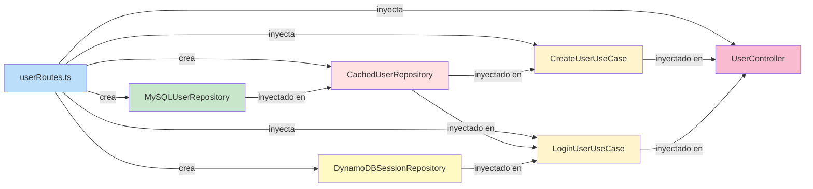

El proyecto usa inyección de dependencias manual con **patrón Decorator**:

```typescript
// En userRoutes.ts

// 1. Crear repository base
const mysqlUserRepository = new MySQLUserRepository();

// 2. Decorar con cache (Decorator Pattern)
const userRepository = new CachedUserRepository(mysqlUserRepository, 3600);

// 3. Crear repository de sesiones
const sessionRepository = new DynamoDBSessionRepository();

// 4. Inyectar en casos de uso
const createUserUseCase = new CreateUserUseCase(userRepository);
const loginUserUseCase = new LoginUserUseCase(userRepository, sessionRepository);

// 5. Inyectar en controlador
const userController = new UserController(
  createUserUseCase,
  loginUserUseCase,
  getUserUseCase,
  logoutUserUseCase,
  userRepository // Para paginación
);

// 6. Crear rate limiters
const registerRateLimit = RateLimitFactory.register();
const loginRateLimit = RateLimitFactory.login();

// 7. Aplicar en rutas
router.post(
  '/register',
  registerRateLimit.middleware(),
  ValidationMiddleware.validate(CreateUserDTO),
  (req, res) => userController.register(req, res)
);
```

**Ventajas:**

- Los casos de uso reciben dependencias como parámetros
- **Decorator Pattern** permite agregar cache sin modificar MySQLUserRepository
- Fácil sustituir implementaciones (ej: PostgreSQL en lugar de MySQL)
- Facilita testing con mocks
- Rate limiters reutilizables con factory pattern

---

## 🧪 Testing Strategy

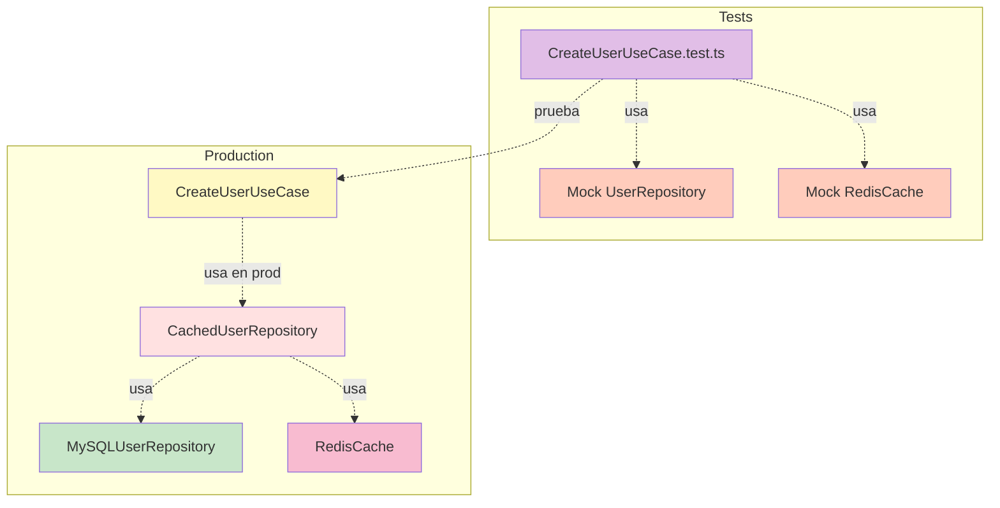

```typescript
// Test de CreateUserUseCase sin caché
const mockRepository: UserRepository = {
  create: jest.fn(),
  findByEmail: jest.fn(),
  findById: jest.fn(),
  // ...
};

const useCase = new CreateUserUseCase(mockRepository);
// Testear sin base de datos real ni Redis

// Test de CachedUserRepository
const mockCache = {
  get: jest.fn(),
  set: jest.fn(),
  del: jest.fn(),
};

const cachedRepo = new CachedUserRepository(mockRepository);
// Verificar lógica de cache
```

**Estrategias de Testing:**

1. **Unit Tests**: Casos de uso con mocks
2. **Integration Tests**: Repositories con base de datos de prueba
3. **E2E Tests**: API completa con Docker
4. **Load Tests**: Rate limiting y performance con herramientas como `k6` o `artillery`

---

## 🚀 Extender la Arquitectura

### Agregar un nuevo caso de uso:

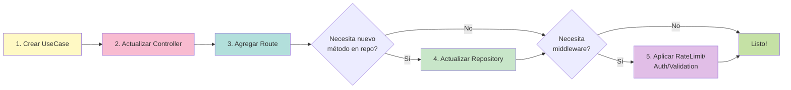

### Cambiar de MySQL a PostgreSQL:

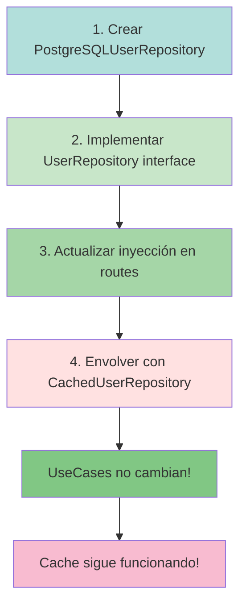

1. Crear `PostgreSQLUserRepository.ts` en `infrastructure/repositories/`
2. Implementar la interfaz `UserRepository`
3. Actualizar la inyección en `userRoutes.ts`:
   ```typescript
   const postgresRepo = new PostgreSQLUserRepository();
   const cachedRepo = new CachedUserRepository(postgresRepo, 3600);
   ```
4. ¡Listo! Los casos de uso y el cache no cambian

### Agregar nuevo tipo de caché (Memcached):

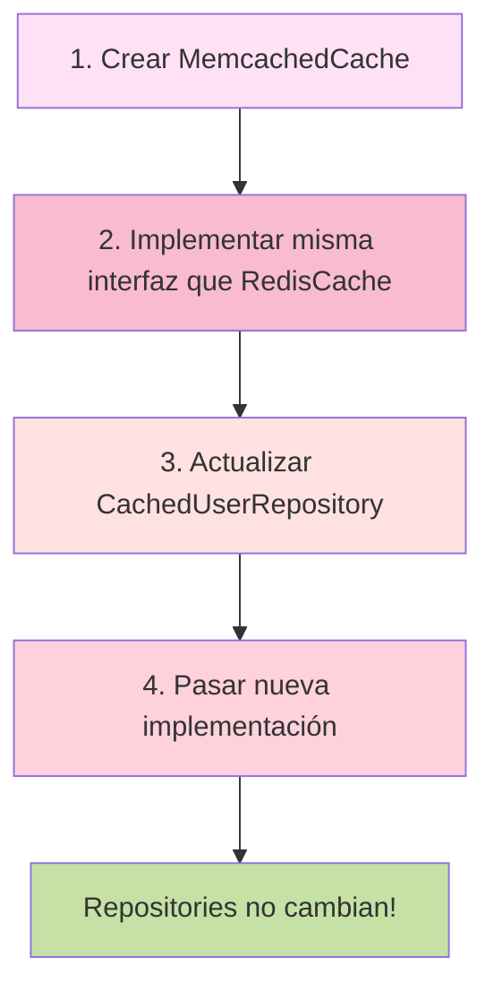

---

## 📊 Diagrama de Clases (Actualizado)

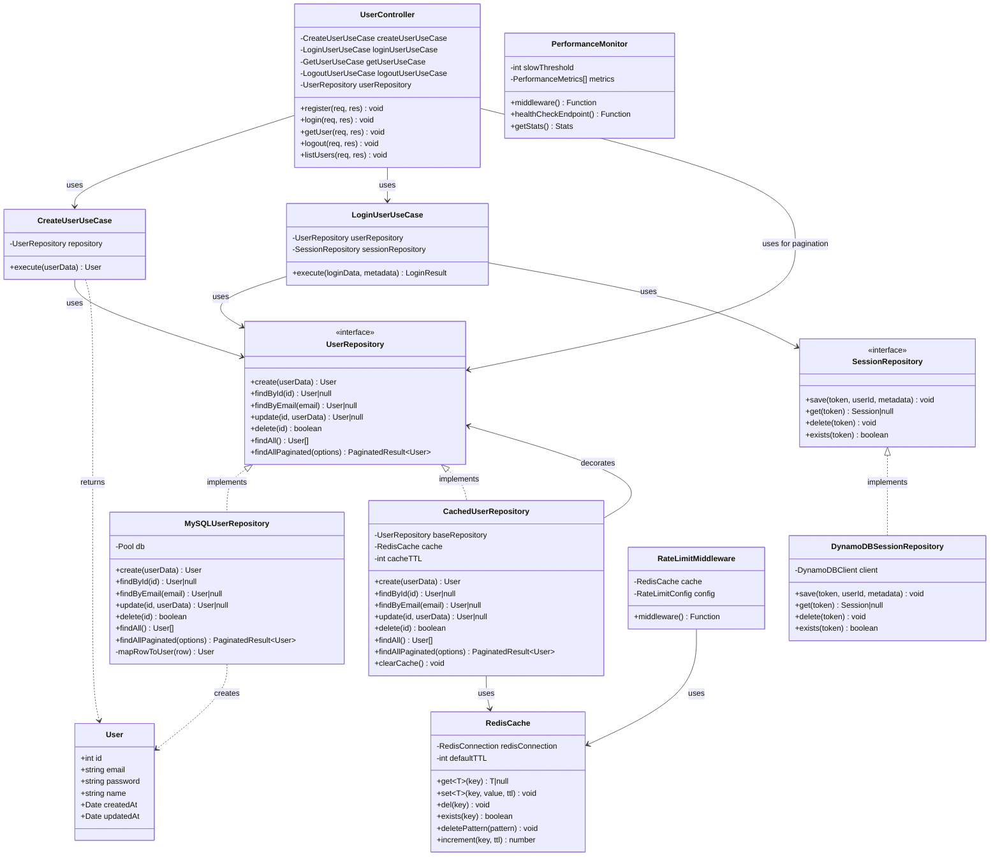

---

## 📚 Recursos Adicionales

- **Clean Architecture** by Robert C. Martin
- **Domain-Driven Design** by Eric Evans
- **SOLID Principles**
- **Dependency Inversion Principle**
- **Decorator Pattern** (Design Patterns: Gang of Four)
- **Cache-Aside Pattern** (Microsoft Azure Architecture Patterns)

---

## 📖 Documentación Relacionada

- [OPTIMIZATION_GUIDE.md](./OPTIMIZATION_GUIDE.md) - Guía completa de optimizaciones con Redis
- [RATE_LIMIT_TESTING.md](./RATE_LIMIT_TESTING.md) - Testing de rate limiting
- [DYNAMODB_SESSIONS_GUIDE.md](./DYNAMODB_SESSIONS_GUIDE.md) - Sesiones en DynamoDB
- [API_EXAMPLES.md](./API_EXAMPLES.md) - Ejemplos de uso de la API
- [DATABASE_SETUP.md](./DATABASE_SETUP.md) - Configuración de bases de datos

---

## 🎓 Conceptos Clave

| Concepto                  | Descripción                                 | Ejemplo en el Proyecto |
| ------------------------- | ------------------------------------------- | ---------------------- |
| **Entity**                | Objeto con identidad única                  | User                   |
| **Use Case**              | Acción específica del sistema               | CreateUserUseCase      |
| **Repository**            | Abstracción para acceso a datos             | UserRepository         |
| **DTO**                   | Data Transfer Object                        | CreateUserDTO          |
| **Dependency Injection**  | Proveer dependencias externamente           | Constructor injection  |
| **Interface Segregation** | Interfaces específicas y pequeñas           | UserRepository         |
| **Decorator Pattern**     | Agregar funcionalidad sin modificar código  | CachedUserRepository   |
| **Cache-Aside**           | Patrón de caché con lazy loading            | CachedUserRepository   |
| **Rate Limiting**         | Limitar requests por ventana de tiempo      | RateLimitMiddleware    |
| **Connection Pool**       | Reutilización de conexiones a base de datos | DatabaseConnection     |
| **Singleton**             | Una sola instancia de una clase             | RedisConnection        |
| **Factory Pattern**       | Crear objetos con métodos específicos       | RateLimitFactory       |

---

## 🔧 Patrones de Diseño Implementados

### 1. **Repository Pattern**

Abstrae el acceso a datos permitiendo cambiar la implementación sin afectar casos de uso.

```typescript
interface UserRepository {
  findById(id: number): Promise<User | null>;
}

class MySQLUserRepository implements UserRepository {}
class PostgreSQLUserRepository implements UserRepository {}
```

### 2. **Decorator Pattern**

Agrega funcionalidad (cache) sin modificar la clase base.

```typescript
class CachedUserRepository implements UserRepository {
  constructor(private baseRepository: UserRepository) {}

  async findById(id: number): Promise<User | null> {
    // Cache logic + delegation to baseRepository
  }
}
```

### 3. **Singleton Pattern**

Garantiza una única instancia de conexiones.

```typescript
class RedisConnection {
  private static instance: RedisConnection;

  static getInstance(): RedisConnection {
    if (!this.instance) {
      this.instance = new RedisConnection();
    }
    return this.instance;
  }
}
```

### 4. **Factory Pattern**

Crea instancias preconfigur adas de rate limiters.

```typescript
class RateLimitFactory {
  static login(): RateLimitMiddleware {
    return new RateLimitMiddleware({
      windowMs: 15 * 60 * 1000,
      maxRequests: 5,
    });
  }
}
```

### 5. **Dependency Injection**

Inyecta dependencias en constructores para facilitar testing y flexibilidad.

```typescript
class CreateUserUseCase {
  constructor(private userRepository: UserRepository) {}
}
```

---

## 🚀 Métricas de Performance

### Antes de Optimizaciones:

- **Latencia promedio**: 50-100ms
- **Throughput**: 200-300 req/s
- **MySQL Load**: 100%

### Después de Optimizaciones:

- **Latencia promedio**: 10-20ms (85-95% cache hits)
- **Throughput**: 1000-2000 req/s
- **MySQL Load**: 5-15%
- **Cache Hit Rate**: 85-95%
- **Rate Limiting**: Activo (protección contra abuso)

---

## 🐳 Stack Tecnológico

| Tecnología                | Propósito               | Puerto |
| ------------------------- | ----------------------- | ------ |
| **Node.js 18**            | Runtime                 | -      |
| **TypeScript**            | Type safety             | -      |
| **Express.js**            | Web framework           | 3000   |
| **MySQL 8.0**             | Base de datos principal | 3306   |
| **Redis 7**               | Cache + Rate limiting   | 6379   |
| **DynamoDB (LocalStack)** | Session storage         | 4567   |
| **Docker**                | Containerization        | -      |
| **Adminer**               | Database UI             | 8080   |

---

## ✅ Checklist de Implementación

Para implementar esta arquitectura en un nuevo feature:

- [ ] Definir entidad en `domain/entities/`
- [ ] Crear interfaz de repository en `domain/repositories/`
- [ ] Implementar repository en `infrastructure/repositories/`
- [ ] Crear use case en `application/use-cases/`
- [ ] Agregar método en controller en `interfaces/controllers/`
- [ ] Definir ruta en `interfaces/routes/`
- [ ] Aplicar middlewares (auth, rate limit, validation)
- [ ] Considerar caché si es lectura frecuente
- [ ] Agregar tests unitarios
- [ ] Documentar en API_EXAMPLES.md
